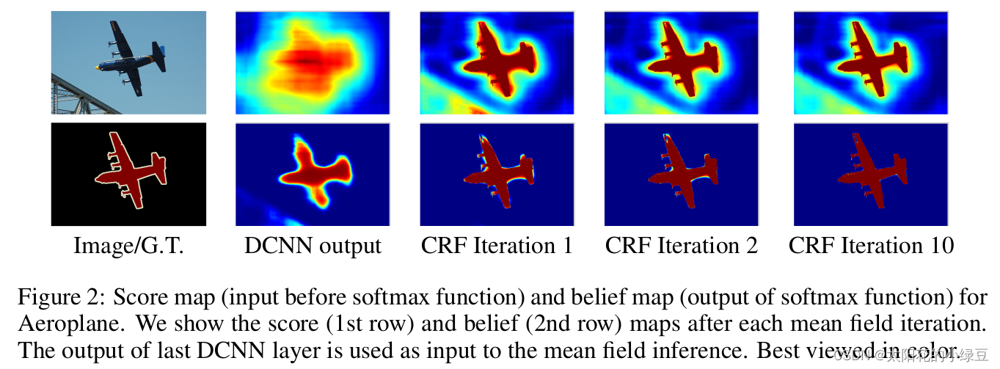
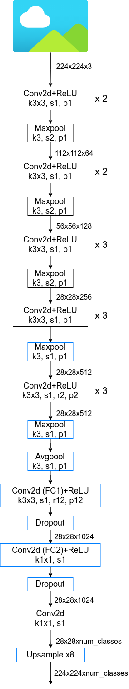
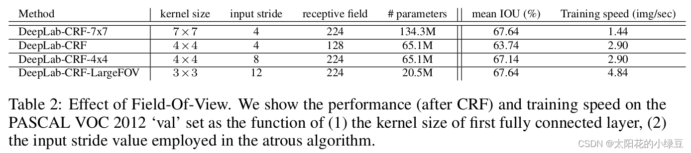
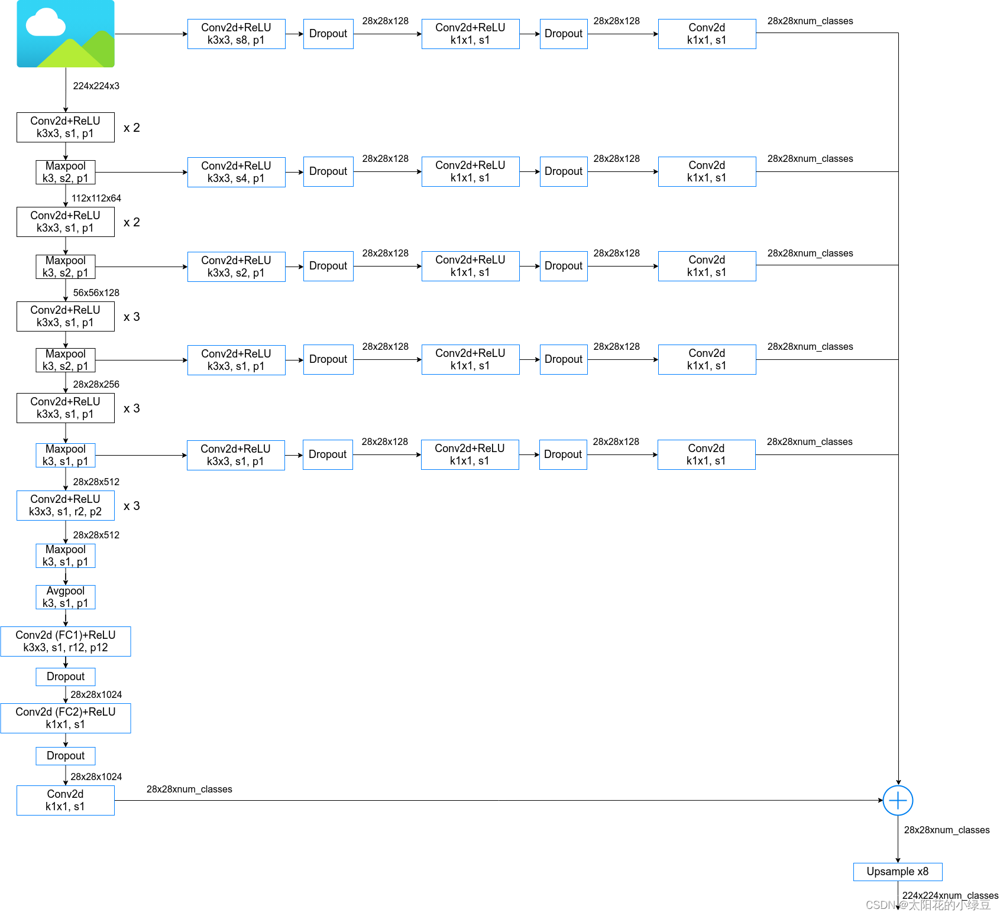
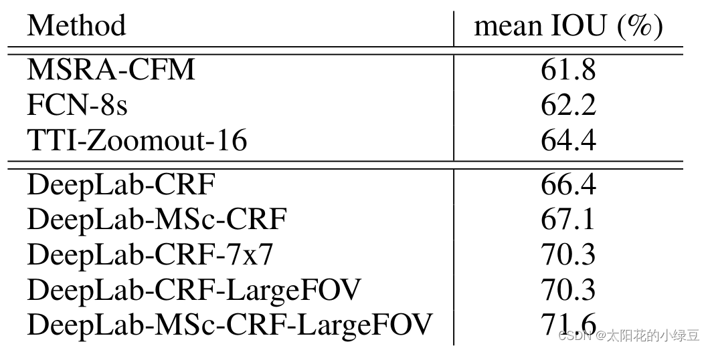

https://blog.csdn.net/qq_37541097/article/details/121692445

原论文名称：Semantic Image Segmentation with Deep Convolutional Nets and Fully Connected CRFs
论文下载地址：https://arxiv.org/abs/1412.7062
参考源码：https://github.com/TheLegendAli/DeepLab-Context

讲解视频： https://www.bilibili.com/video/BV1SU4y1N7Ao

这篇文章最早发表于2014年，是Google和UCLA等共同的杰作，也是一篇很经典的论文，DeepLab系列的第一篇论文。因为已经过了很久了，所以本博文只做部分简单的记录。

# 语义分割任务中存在的问题

在论文的引言部分(INTRODUCTION)首先抛出了两个问题（针对语义分割任务）: **信号下采样导致分辨率降低**和**空间“不敏感”** 问题。

> There are two technical hurdles in the application of DCNNs to image labeling tasks: signal downsampling, and spatial ‘insensitivity’ (invariance).

对于第一个问题**信号下采样**，作者说主要是采用Maxpooling导致的，为了解决这个问题作者引入了`'atrous'(with holes) algorithm`（空洞卷积 / 膨胀卷积 / 扩张卷积），如果不了解的可以参考我在bilibili上录的[讲解视频](https://b23.tv/gwjx6xx)。

对于第二个问题空间“不敏感”，作者说分类器自身的问题（分类器本来就具备一定空间不变性），我个人认为其实还是Maxpooling导致的。为了解决这个问题作者采用了fully-connected CRF(Conditional Random Field)方法，这个方法只在DeepLabV1-V2中使用到了，从V3之后就不去使用了，而且这个方法挺耗时的。

# DeepLabV1的优势

相比之前的一些网络，本文提出的网络具有以下优势：

- 速度更快，论文中说是因为采用了膨胀卷积的原因，但fully-connected CRF很耗时
- 准确率更高，相比之前最好的网络提升了7.2个点
- 模型很简单，主要由DCNN和CRF联级构成

# 网络搭建细节

## LargeFOV

首先网络的backbone是当时比较火的VGG-16，并且**和FCN网络一样将全连接层的权重转成了卷积层的权重**，构成全卷积网络。然后关于膨胀卷积的使用，论文中是这么说的：

> We skip subsampling after the last two max-pooling layers in the network of Simonyan & Zisserman (2014) and modify the convolutional filters in the layers that follow them by introducing zeros to increase their length (2×in the last three convolutional layers and 4× in the first fully connected layer).

感觉文中的`skip subsampling`说的有点模糊（可能是自己英语水平太菜）什么叫做跳过下采样。既然看不懂论文的表述，就去看看代码。根据代码我绘制了如下所示的网络结构（DeepLab-LargeFOV）。

上图中 r 是膨胀卷积系数.

通过分析发现虽然backbone是VGG-16但所使用Maxpool略有不同，VGG论文中是`kernel=2，stride=2`，但在DeepLabV1中是`kernel=3，stride=2，padding=1`。**接着就是最后两个Maxpool层的stride全部设置成1了（这样下采样的倍率就从32变成了8）**。最后三个`3x3`的卷积层采用了膨胀卷积，膨胀系数`r=2`。**然后关于将全连接层卷积化过程中，对于第一个全连接层（FC1）在FCN网络中是直接转换成卷积核大小7x7，卷积核个数为4096的卷积层，但在DeepLabV1中作者说是对参数进行了下采样最终得到的是卷积核大小3x3，卷积核个数为1024的卷积层（这样不仅可以减少参数还可以减少计算量，详情可以看下论文中的Table2），对于第二个全连接层（FC2）卷积核个数也由4096采样成1024。**

> After converting the network to a fully convolutional one, the first fully connected layer has 4,096 filters of large 7 × 7 spatial size and becomes the computational bottleneck in our dense score map computation. We have addressed this practical problem by spatially subsampling (by simple decimation) the first FC layer to 4×4 (or 3×3) spatial size.

将FC1卷积化后，还设置了膨胀系数，论文3.1中说的是`r=4`但在`Experimental Evaluation`中`Large of View`章节里设置的是`r=12`对应`LargeFOV`。对于FC2卷积化后就是卷积核`1x1`，卷积核个数为1024的卷积层。接着再通过一个卷积核`1x1`，卷积核个数为`num_classes`（包含背景）的卷积层。最后通过8倍上采样还原回原图大小。

下表是关于是否使用LargeFOV（Field of View）的对比。

- 第一行`DeepLab-CRF-7x7`就是直接将FC1按照FCN论文中的方法转换成7x7大小的卷积层，并且膨胀因子r=4（receptive field=224）。
- 第二行`DeepLab-CRF`是将7x7下采样到4x4大小的卷积层，同样膨胀因子r=4（receptive field=128），可以看到参数减半，训练速度翻倍，但mean IOU下降了约4个点。
- 第三行`DeepLab-CRF-4x4`，是在`DeepLab-CRF`的基础上把膨胀因子r改成了8（receptive field=224），mean IOU又提升了回去了。
- 第四行`DeepLab-CRF-LargeFOV`，是将7x7下采样到3x3大小的卷积层，膨胀因子r=12（receptive field=224），相比`DeepLab-CRF-7x7`，参数减少了6倍，训练速度提升了3倍多，mean IOU不变。

## MSC(Multi-Scale)

其实在论文的4.3中还提到了Multi-Scale Prediction，即融合多个特征层的输出。关于MSc(Multi-Scale)的结构论文中是这么说的：

> Specifically, we attach to the input image and the output of each of the first four max pooling layers a
> two-layer MLP (first layer: 128 3x3 convolutional filters, second layer: 128 1x1 convolutional filters) whose feature map is concatenated to the main network’s last layer feature map. The aggregate feature map fed into the softmax layer is thus enhanced by 5 * 128 = 640 channels.

即，除了使用之前主分支上输出外，还融合了来自原图尺度以及前四个Maxpool层的输出，更详细的结构参考下图。论文中说使用MSc大概能提升1.5个点，使用fully-connected CRF大概能提升4个点。但在源码中作者建议使用的是不带MSc的版本，以及看github上的一些开源实现都没有使用MSc。我个人猜测是因为这里的MSc不仅费时而且很吃显存。根据参考如下代码绘制了`DeepLab-MSc-LargeFOV`结构。

https://www.cs.jhu.edu/~alanlab/ccvl/DeepLab-MSc-LargeFOV/train.prototxt

下表是在PASCAL VOC2012 test数据集上的一个消融实验：

关于fully-connected CRF，说实话不太懂，这里就不讲了。