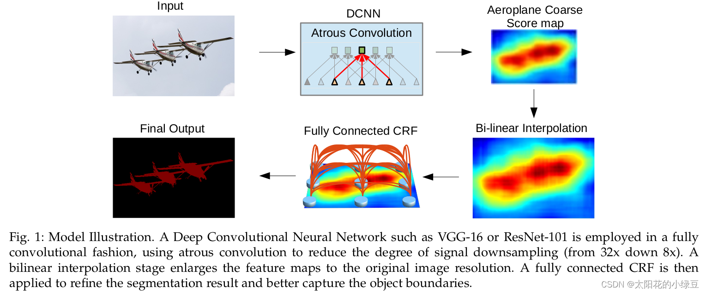
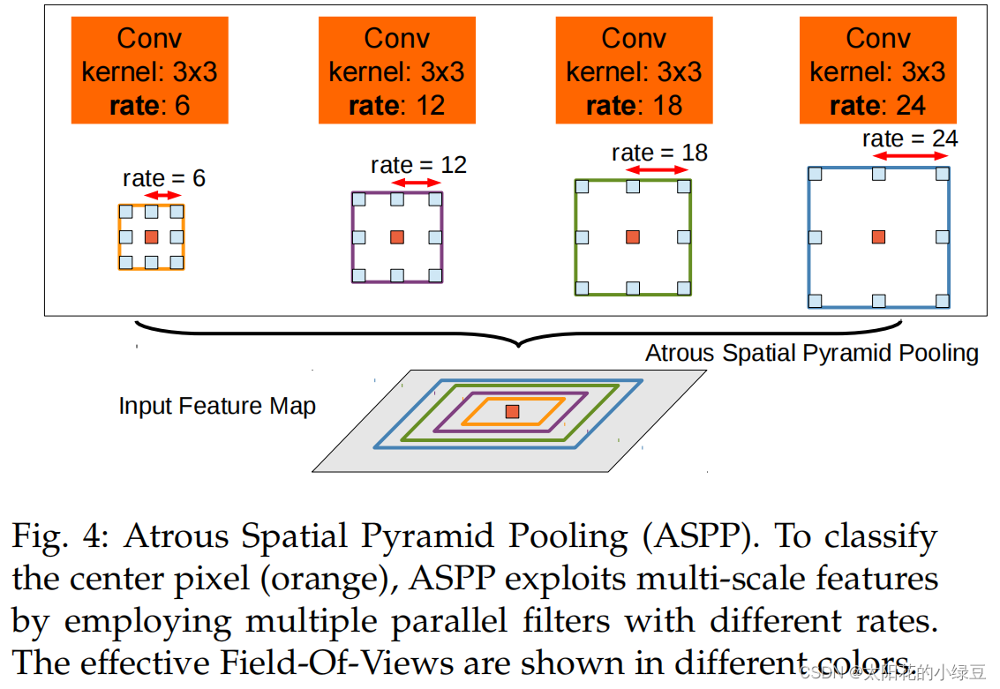
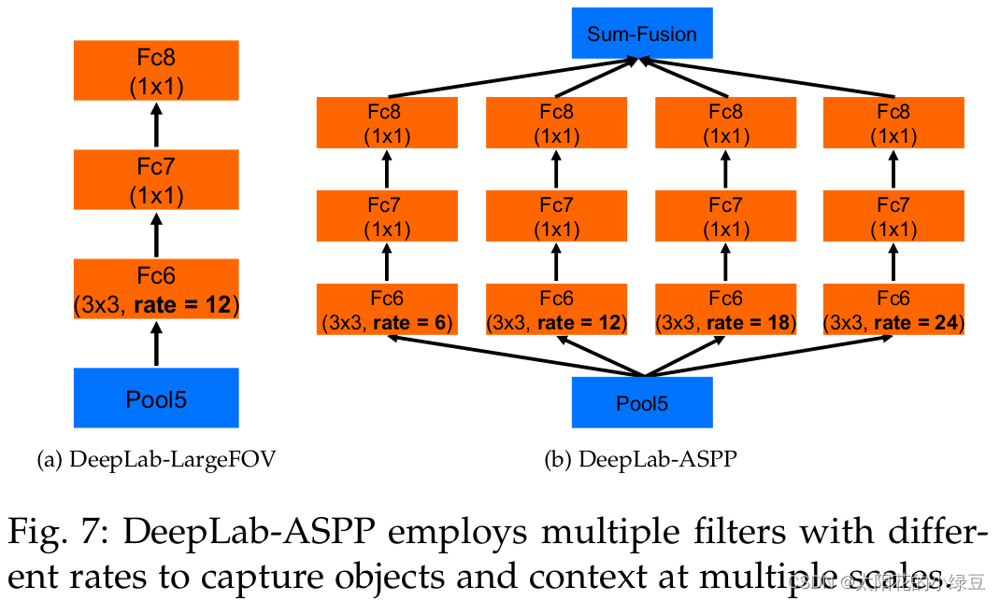
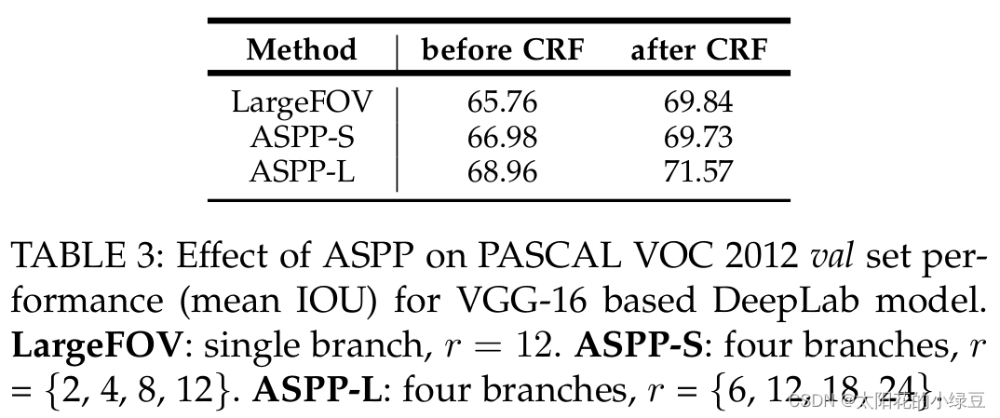
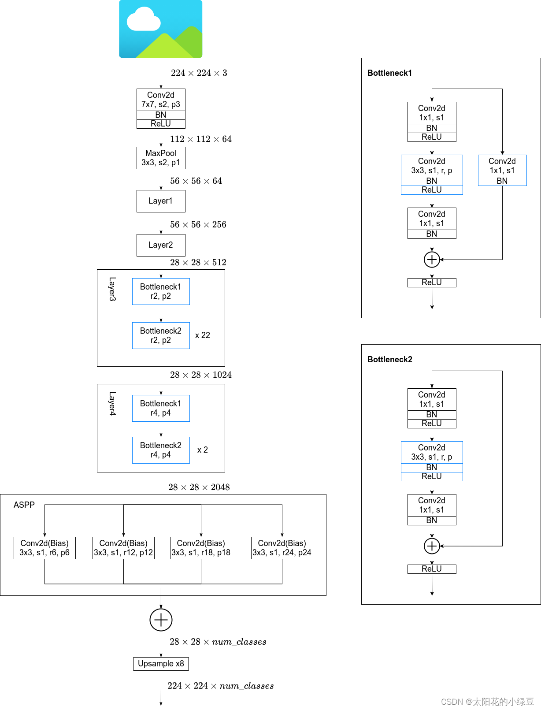
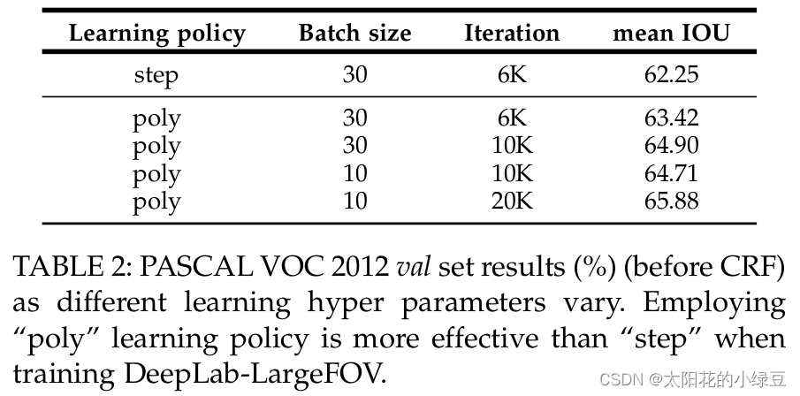
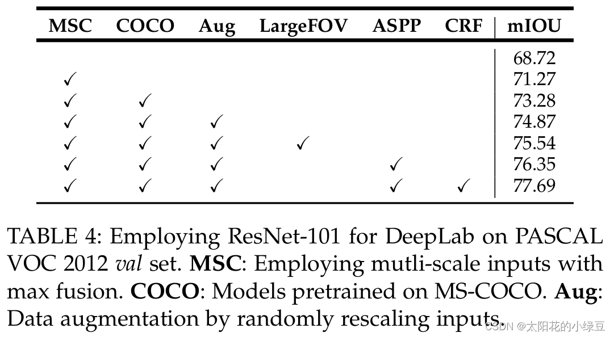

https://blog.csdn.net/qq_37541097/article/details/121752679

论文名称：Semantic Image Segmentation with Deep Convolutional Nets, Atrous Convolution, and Fully Connected CRFs
论文下载地址：https://arxiv.org/abs/1606.00915
论文对应开源项目：http://liangchiehchen.com/projects/DeepLab.html

视频讲解：https://www.bilibili.com/video/BV1gP4y1G7TC

这是一篇2016年发布在CVPR上的文章。接着上一篇[DeepLab V1网络简介](https://blog.csdn.net/qq_37541097/article/details/121692445)，本文对DeepLab V2网络进行简单介绍。个人感觉相对DeepLab V1，DeepLab V2就是换了个backbone（VGG -> ResNet，简单换个backbone就能涨大概3个点）然后引入了一个新的模块ASPP（Atros Spatial Pyramid Pooling），其他的没太大区别。

# DCNNs应用在语义分割任务中问题

和上篇文章一样，在文章的引言部分作者提出了DCNNs应用在语义分割任务中遇到的问题。

- 分辨率被降低（主要由于下采样`stride>1`的层导致）
- 目标的多尺度问题
- DCNNs的不变性(invariance)会降低定位精度

# 文中对应的解决办法

- 针对分辨率被降低的问题，一般就是将最后的几个Maxpooling层的stride给设置成1(如果是通过卷积下采样的，比如resnet，同样将stride设置成1即可)，然后在配合使用膨胀卷积。

> In order to overcome this hurdle and efficiently produce denser feature maps, we remove the downsampling operator from the last few max pooling layers of DCNNs and instead upsample the filters in subsequent convolutional layers, resulting in feature maps computed at a higher sampling rate. Filter upsampling amounts to inserting holes (‘trous’ in French) between nonzero filter taps.

- 针对目标多尺度的问题，最容易想到的就是将图像缩放到多个尺度分别通过网络进行推理，最后将多个结果进行融合即可。这样做虽然有用但是计算量太大了。为了解决这个问题，DeepLab V2 中提出了ASPP模块（atrous spatial pyramid pooling），具体结构后面会讲。

> A standard way to deal with this is to present to the DCNN rescaled versions of the same image and then aggregate the feature or score maps. We show that this approach indeed increases the performance of our system, but comes at the cost of computing feature responses at all DCNN layers for multiple scaled versions of the input image. Instead, motivated by spatial pyramid pooling, we propose a computationally efficient scheme of resampling a given feature layer at multiple rates prior to convolution. This amounts to probing the original image with multiple filters that have complementary effective fields of view, thus capturing objects as well as useful image context at multiple scales. Rather than actually resampling features, we efficiently implement this mapping using multiple parallel atrous convolutional layers with different sampling rates; we call the proposed technique “atrous spatial pyramid pooling” (ASPP).

- 针对DCNNs不变性导致定位精度降低的问题，和DeepLab V1差不多还是通过CRFs解决，不过这里用的是`fully connected pairwise CRF`，相比V1里的`fully connected CRF`要更高效点。在DeepLab V2中CRF涨点就没有DeepLab V1猛了，在DeepLab V1中大概能提升4个点，在DeepLab V2中通过Table4可以看到大概只能提升1个多点了。

> Our work explores an alternative approach which we show to be highly effective. In particular, we boost our model’s ability to capture fine details by employing a fully-connected Conditional Random Field (CRF) [22]. CRFs have been broadly used in semantic segmentation to combine class scores computed by multi-way classifiers with the low-level information captured by the local interactions of pixels and edges [23], [24] or superpixels [25]. Even though works of increased sophistication have been proposed to model the hierarchical dependency [26], [27], [28] and/or high-order dependencies of segments [29], [30], [31], [32], [33], we use the fully connected pairwise CRF proposed by [22] for its efficient computation, and ability to capture fine edge details while also catering for long range dependencies.

# DeepLab V2的优势

和DeepLab V1中写的一样：

- 速度更快
- 准确率更高（当时的`state-of-art`）
- 模型结构简单，还是DCNNs和CRFs联级

> From a practical standpoint, the three main advantages of our DeepLab system are: (1) Speed: by virtue of atrous convolution, our dense DCNN operates at 8 FPS on an NVidia Titan X GPU, while Mean Field Inference for the fully-connected CRF requires 0.5 secs on a CPU. (2) Accuracy: we obtain state-of-art results on several challenging datasets, including the PASCAL VOC 2012 semantic segmentation benchmark [34], PASCAL-Context [35], PASCAL-Person-Part [36], and Cityscapes [37]. (3) Simplicity: our system is composed of a cascade of two very well-established modules, DCNNs and CRFs.

# ASPP(atrous spatial pyramid pooling)

个人觉得在DeepLab V2中值得讲的就这个ASPP模块了，其他的都算不上啥亮点。这个ASPP模块给我感觉就像是DeepLab V1中LargeFOV的升级版（加入了多尺度的特性）。下图是原论文中介绍ASPP的示意图，就是在backbone输出的Feature Map上并联四个分支，每个分支的第一层都是使用的膨胀卷积，但不同的分支使用的膨胀系数不同（即每个分支的感受野不同，从而具有解决目标多尺度的问题）。

下图(b)有画出更加详细的ASPP结构（**这里是针对VGG网络为例的**），将Pool5输出的特征层（这里以VGG为例）并联4个分支，每个分支分别通过一个3x3的膨胀卷积层，1x1的卷积层，1x1的卷积层（卷积核的个数等于`num_classes`）。最后将四个分支的结果进行Add融合即可。 **如果是以ResNet101做为Backbone的话，每个分支只有一个3x3的膨胀卷积层**，卷积核的个数等于`num_classes`（看源码分析得到的）。

在论文中有给出两个ASPP的配置，ASPP-S（四个分支膨胀系数分别为`2,4,8,12`）和ASPP-L（四个分支膨胀系数分别为`6,12,18,24`），下表是对比`LargeFOV`、`ASPP-S`以及`ASPP-L`的效果。这里只看CRF之前的（before CRF）对比，`ASPP-L`优于`ASPP-S`优于`LargeFOV`。

# DeepLab V2网络结构

这里以ResNet101作为backbone为例，下图是根据官方源码绘制的网络结构（**这里不考虑MSC即多尺度**）。

**在ResNet的Layer3中的Bottleneck1中原本是需要下采样的（3x3的卷积层stride=2），但在DeepLab V2中将stride设置为1，即不在进行下采样。而且3x3卷积层全部采用膨胀卷积膨胀系数为2。**

**在Layer4中也是一样，取消了下采样，所有的3x3卷积层全部采用膨胀卷积膨胀系数为4。**

**最后需要注意的是ASPP模块，在以ResNet101做为Backbone时，每个分支只有一个3x3的膨胀卷积层，且卷积核的个数都等于`num_classes`。**

**右侧的Bottleneck的3x3Conv都使用了膨胀卷积。**

# Learning rate policy

在DeepLab V2中训练时采用的学习率策略叫`poly`，相比普通的`step`策略（即每间隔一定步数就降低一次学习率）效果要更好。文中说最高提升了3.63个点，真是炼丹大师。`poly`学习率变化策略公式如下：
$$
lr \times (1 - \frac {iter} {max\_iter})^{power}
$$
其中 $lr$ 为初始学习率， $iter$ 为当前迭代的step数，$max\_iter$ 为训练过程中总的迭代步数, $power=0.9$。关于炼丹对比，见原文TABLE2：

# 消融实验

下表是原论文中给出的一些消融实验对比：

中：

- MSC表示多尺度输入，即先将图像缩放到0.5、0.7和1.0三个尺度，然后分别送入网络预测得到score maps，最后融合这三个score maps（对每个位置取三个score maps的最大值）。

> Multi-scale inputs: We separately feed to the DCNN images at scale = { 0.5, 0.75, 1 } , fusing their score maps by taking the maximum response across scales for each position separately.

- COCO就代表在COCO数据集上进行预训练

> Models pretrained on MS-COCO.

- Aug代表数据增强，这里就是对输入的图片在0.5到1.5之间随机缩放。

> Data augmentation by randomly scaling the input images (from 0.5 to 1.5) during training.

- LargeFOV是在DeepLab V1中讲到过的结构。
- ASPP前面讲过了
- CRF前面也提到过了

每个方法带来的增益看原论文表述，这里不太叙述：

> we evaluate how each of these factors, along with LargeFOV and atrous spatial pyramid pooling (ASPP), affects val set performance. Adopting ResNet-101 instead of VGG-16 significantly improves DeepLab performance (e.g., our simplest ResNet-101 based model attains 68.72%, compared to 65.76% of our DeepLab-LargeFOV VGG-16 based variant, both before CRF). Multiscale fusion [17] brings extra 2.55% improvement, while pretraining the model on MS-COCO gives another 2.01% gain. Data augmentation during training is effective (about 1.6% improvement). Employing LargeFOV (adding an atrous convolutional layer on top of ResNet, with 3×3 kernel and rate = 12) is beneficial (about 0.6% improvement). Further 0.8% improvement is achieved by atrous spatial pyramid pooling(ASPP). Post-processing our best model by dense CRF yields performance of 77.69%.

