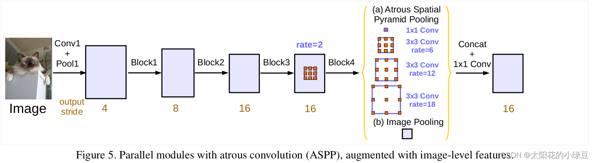
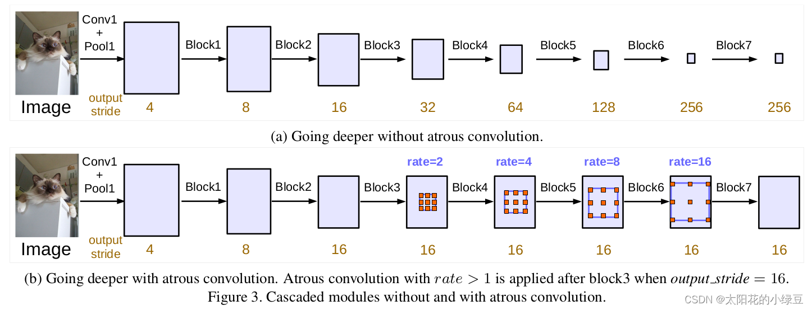
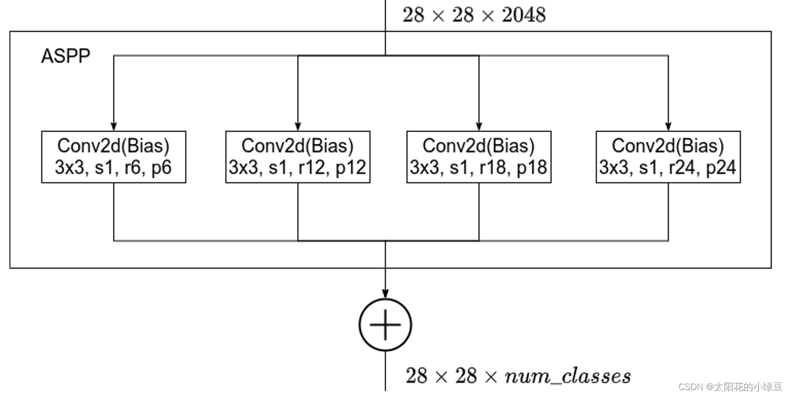
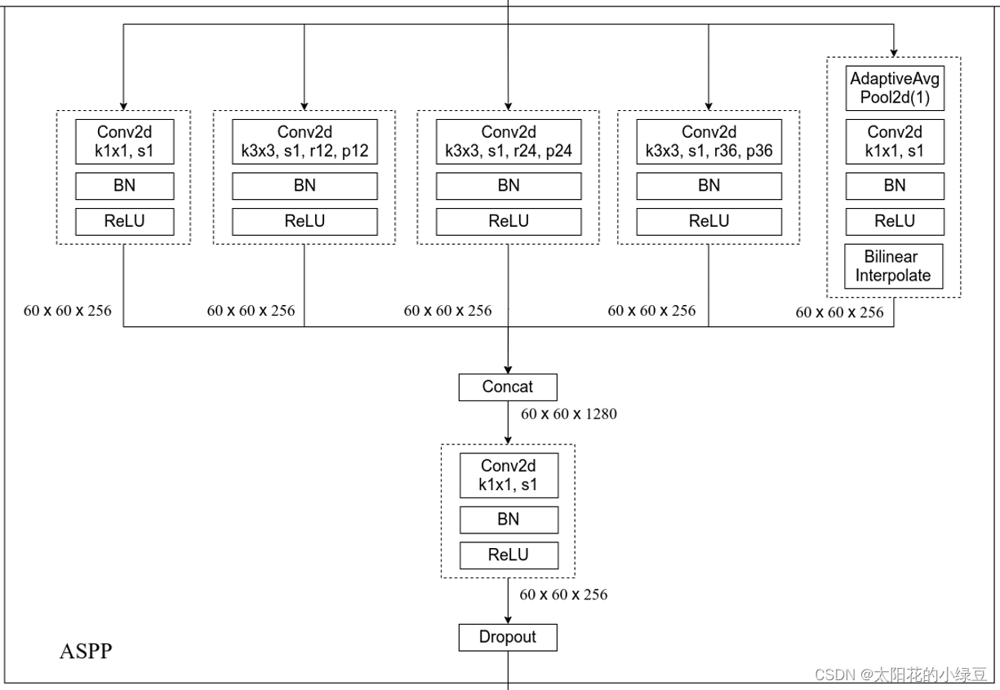
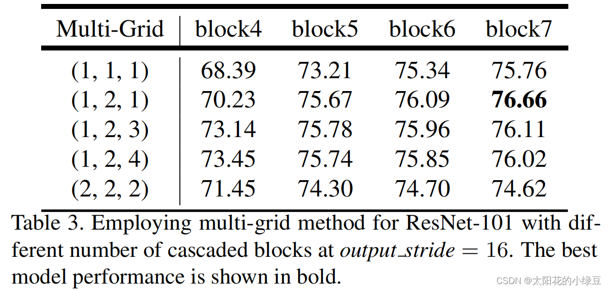
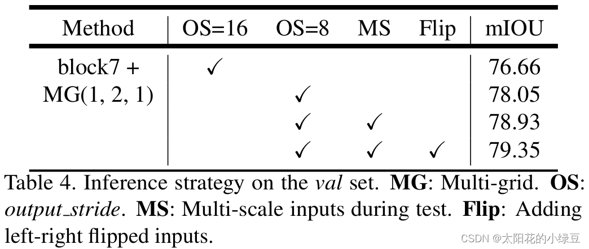
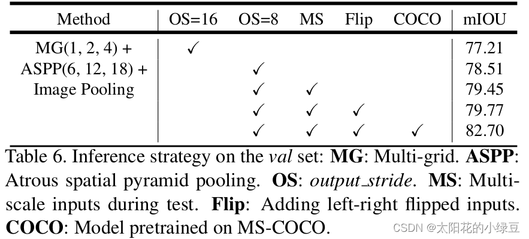
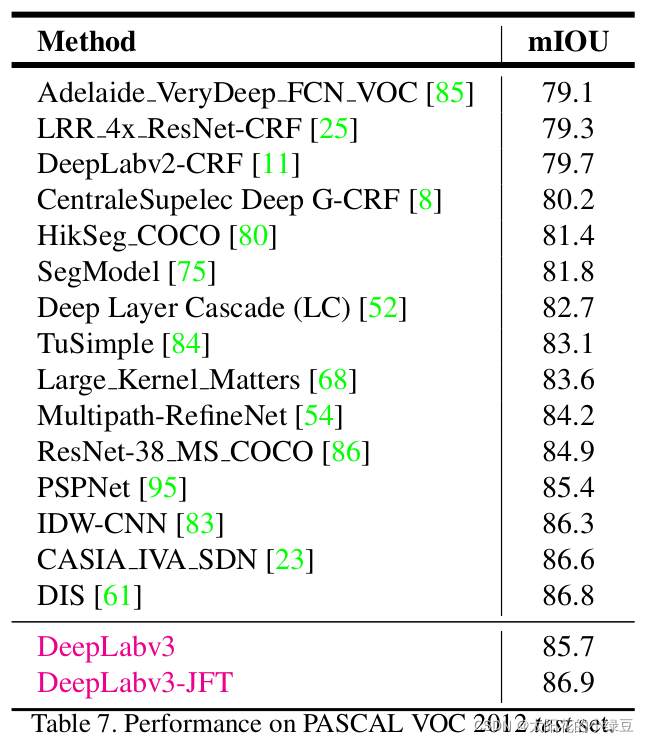
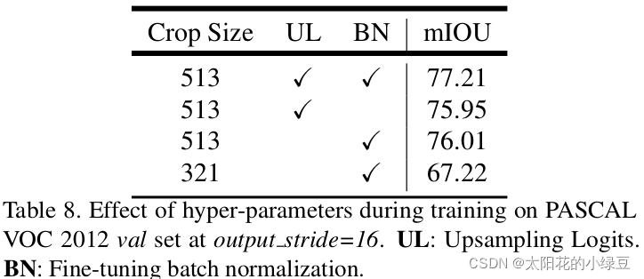
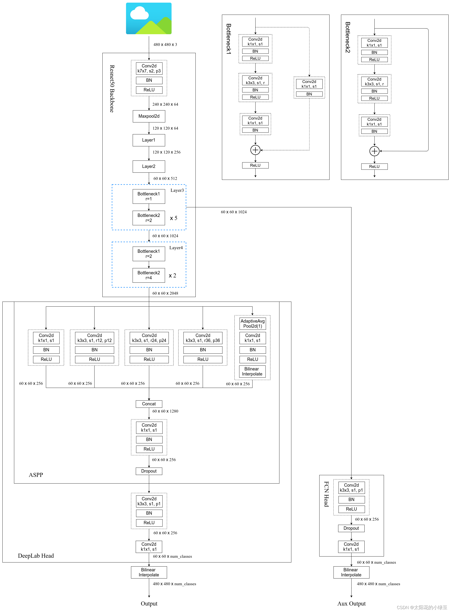

https://blog.csdn.net/qq_37541097/article/details/121797301

论文名称：Rethinking Atrous Convolution for Semantic Image Segmentation
论文下载地址：https://arxiv.org/abs/1706.05587
非官方Pytorch实现代码：pytorch_segmentation/deeplab_v3

视频讲解：https://www.bilibili.com/video/BV1Jb4y1q7j7




接着上篇[DeepLab V2](https://blog.csdn.net/qq_37541097/article/details/121752679)，本博文简单介绍下DeepLab V3（建议先去看下之前讲的[DeepLab V1](https://blog.csdn.net/qq_37541097/article/details/121692445)和[DeepLab V2](https://blog.csdn.net/qq_37541097/article/details/121752679)）。这是一篇2017年发表在CVPR上的文章。个人简单阅读完论文后感觉相比DeepLab V2有三点变化：1）引入了`Multi-grid`，2）改进了`ASPP`结构，3）把`CRFs`后处理给移除掉了。再吐槽一下，这篇论文看着感觉乱糟糟的。本篇博文就不按照论文的顺序去写了，直接按照我个人的想法去写。

# DeepLabV3两种模型结构

其实这篇文章让我感觉看着乱糟糟的主要原因就是文中有给出两个模型，然后一会儿讲这个模型的实验，一会儿讲另一个模型的实验。这两个模型分别是`cascaded model`和`ASPP model`，在`cascaded model`中是没有使用ASPP模块的，在`ASPP model`中是没有使用cascaded blocks模块的，如果没有弄清楚这两个模型的区别，那么这篇文章就算不上看懂。**注意，虽然文中提出了两种结构，但作者说ASPP model比cascaded model略好点。包括在Github上开源的一些代码，大部分也是用的ASPP model。**

> Both our best cascaded model (in Tab. 4) and ASPP model (in Tab. 6) (in both cases without DenseCRF post-processing or MS-COCO pre-training) already outperform DeepLabv2.

## cascaded model

在这篇论文中，大部分实验基本都是围绕cascaded model来做的。如下图所示，论文中提出的cascaded model指的是图(b)。其中`Block1`，`Block2`，`Block3`，`Block4`是原始ResNet网络中的层结构，但在`Block4`中将第一个残差结构里的3x3卷积层以及捷径分支上的1x1卷积层步距stride由2改成了1（即不再进行下采样），并且所有残差结构里3x3的普通卷积层都换成了膨胀卷积层。`Block5`，`Block6`和`Block7`是额外新增的层结构，他们的结构和`Block4`是一模一样的，即由三个残差结构构成。



**注意**，原论文中说在训练cascaded model时`output_stride=16`（即特征层相对输入图片的下采样率），但验证时使用的`output_stride=8`（这里论文里虽然没有细讲，但我猜应该是把`Block3`中的下采样取消了）。因为`output_stride=16`时最终得到的特征层H和W会更小，这意味着可以设置更大的batch_size并且能够加快训练速度。但特征层H和W变小会导致特征层丢失细节信息（文中说变的更“粗糙”），所以在验证时采用的`output_stride=8`。其实只要你GPU显存足够大，算力足够强也可以直接把`output_stride`设置成8。

> Also note that training with output stride = 16 is several times faster than output stride = 8 since the intermediate feature maps are spatially four times smaller, but at a sacrifice of accuracy since output stride = 16 provides coarser feature maps.

**另外需要注意的是，图中标注的rate并不是膨胀卷积真正采用的膨胀系数。** 真正采用的膨胀系数应该是图中的rate乘上Multi-Grid参数，比如Block4中`rate=2`，`Multi-Grid=(1, 2, 4)`那么真正采用的膨胀系数是`2 x (1, 2, 4)=(2, 4, 8)`。关于Multi-Grid参数后面会提到。

> The final atrous rate for the convolutional layer is equal to the multiplication of the unit rate and the corresponding rate. For example, when output stride = 16 and Multi Grid = (1, 2, 4), the three convolutions will have rates = 2 · (1, 2, 4) = (2, 4, 8) in the block4, respectively.

## ASPP model

虽然论文大篇幅的内容都在讲cascaded model以及对应的实验，但实际使用的最多的还是ASPP model，ASPP model结构如下图所示：


**注意**，和cascaded model一样，原论文中说在训练时`output_stride=16`（即特征层相对输入图片的下采样率），但验证时使用的`output_stride=8`。但在Pytorch官方实现的DeepLabV3源码中就直接把`output_stride`设置成8进行训练的。

接下来分析下DeepLab V3中ASPP结构。首先回顾下上篇博文中讲的DeepLab V2中的ASPP结构，DeepLab V2中的ASPP结构其实就是通过四个并行的膨胀卷积层，每个分支上的膨胀卷积层所采用的膨胀系数不同（注意，这里的膨胀卷积层后没有跟BatchNorm并且使用了偏执Bias）。接着通过add相加的方式融合四个分支上的输出。



我们再来看下DeepLab V3中的ASPP结构。这里的ASPP结构有5个并行分支，分别是一个1x1的卷积层，三个3x3的膨胀卷积层，以及一个全局平均池化层（后面还跟有一个1x1的卷积层，然后通过双线性插值的方法还原回输入的W和H）。关于最后一个全局池化分支作者说是为了增加一个全局上下文信息`global context information`。然后通过Concat的方式将这5个分支的输出进行拼接（沿着channels方向），最后在通过一个1x1的卷积层进一步融合信息。



关于原论文中ASPP（Atrous Spatial Pyramid Pooling）结构介绍可以看下下面这段话。

> Specifically, we apply global average pooling on the last feature map of the model, feed the resulting image-level features to a 1 × 1 convolution with 256 filters (and batch normalization [38]), and then bilinearly upsample the feature to the desired spatial dimension. In the end, our improved ASPP consists of (a) one 1×1 convolution and three 3 × 3 convolutions with rates = (6, 12, 18) when output stride = 16 (all with 256 filters and batch normalization), and (b) the image-level features, as shown in Fig. 5. Note that the rates are doubled when output stride = 8. The resulting features from all the branches are then concatenated and pass through another 1 × 1 convolution (also with 256 filters and batch normalization) before the final 1 × 1 convolution which generates the final logits.

# Multi-grid

在之前的DeepLab模型中虽然一直在使用膨胀卷积，但设置的膨胀系数都比较随意。在DeepLab V3中作者有去做一些相关实验看如何设置更合理。下表是以`cascaded model`（ResNet101作为Backbone为例）为实验对象，研究采用不同数量的cascaded blocks模型以及cascaded blocks采用不同的`Multi-Grid`参数的效果。**注意**，刚刚在讲`cascaded model`时有提到，blocks中真正采用的膨胀系数应该是图中的rate乘上这里的Multi-Grid参数。通过实验发现，当采用三个额外的Block时（即额外添加Block5，Block6和Block7）将Multi-Grid设置成`(1, 2, 1)`效果最好。另外如果不添加任何额外Block（即没有Block5，Block6和Block7）将Multi-Grid设置成`(1, 2, 4)`效果最好，因为在`ASPP model`中是没有额外添加Block层的，后面讲`ASPP model`的消融实验时采用的就是Multi-Grid等于`(1, 2, 4)`的情况。



论文中关于Multi-Grid的实验介绍如下：

> We apply the multi-grid method to ResNet-101 with several cascadedly added blocks in Tab. 3. The unit rates, Multi Grid = (r1, r2, r3), are applied to block4 and all the other added blocks. As shown in the table, we observe that (a) applying multi-grid method is generally better than the vanilla version where (r1, r2, r3) = (1, 1, 1), (b) simply doubling the unit rates (i.e., (r1, r2, r3) = (2, 2, 2)) is not effective, and © going deeper with multi-grid improves the performance. Our best model is the case where block7 and (r1, r2, r3) = (1, 2, 1) are employed.

# Learning rate policy

在DeepLab V2中训练时采用的学习率策略叫`poly`，相比普通的`step`策略（即每间隔一定步数就降低一次学习率）效果要更好。V2论文中说最高提升了3.63个点，真是炼丹大师。`poly`学习率变化策略公式如下：
$$
lr \times (1 - \frac {iter} {max\_iter})^{power}
$$
其中 $lr$ 为初始学习率， $iter$ 为当前迭代的step数，$max\_iter$ 为训练过程中总的迭代步数, $power=0.9$。

**注意：是iter，每次反向传播后都进行学习率衰减**

```python
def create_lr_scheduler(optimizer,
                        num_step: int,          # 训练一个epoch要走多少step
                        epochs: int,            # 训练epoch数
                        warmup=True,
                        warmup_epochs=1,        # 热身训练要保持1轮
                        warmup_factor=1e-3):
    assert num_step > 0 and epochs > 0
    if warmup is False:
        warmup_epochs = 0

    def f(x):
        """
        x: step
        return:
            倍率因子
        根据step数返回一个学习率倍率因子，
        注意在训练开始之前，pytorch会提前调用一次lr_scheduler.step()方法
        """
        if warmup is True and x <= (warmup_epochs * num_step):
            alpha = float(x) / (warmup_epochs * num_step)
            #---------------------------------------------------------#
            #   warmup过程中lr倍率因子从warmup_factor -> 1
            #---------------------------------------------------------#
            return warmup_factor * (1 - alpha) + alpha
        else:
            #---------------------------------------------------------#
            #   warmup后lr倍率因子从1 -> 0
            #   参考deeplab_v2: Learning rate policy
            #   注意减去了$warmup_epochs * num_step$,它是warp总step数
            #   lr \times (1 - \frac {iter} {max\_iter})^{power}
            #---------------------------------------------------------#
            return (1 - (x - warmup_epochs * num_step) / ((epochs - warmup_epochs) * num_step)) ** 0.9

    return torch.optim.lr_scheduler.LambdaLR(optimizer, lr_lambda=f)
```


# 消融实验

## cascaded model消融实验

下表是有关cascaded model的消融实验，其中：

- MG代表Multi-Grid，刚刚在上面也有说在cascaded model中采用MG(1, 2, 1)是最好的。
- OS代表output_stride，刚刚在上面也有提到过验证时将output_stride设置成8效果会更好。
- MS代表多尺度，和DeepLabV2中类似。不过在DeepLab V3中采用的尺度更多scales = {0.5, 0.75, 1.0, 1.25, 1.5, 1.75}。
- Flip代表增加一个水平翻转后的图像输入。



## ASPP model消融实验

下表是有关ASPP model的消融实验，其中：

- MG代表Multi-Grid，刚刚在上面也有说在ASPP model中采用MG(1, 2, 4)是最好的。
- ASPP前面讲过。
- Image Pooling代表在ASPP中加入全局平均池化层分支。
- OS代表output_stride，刚刚在上面也有提到过验证时将output_stride设置成8效果会更好。
- MS代表多尺度，和DeepLabV2中类似。不过在DeepLab V3中采用的尺度更多scales = {0.5, 0.75, 1.0, 1.25, 1.5, 1.75}。
- Flip代表增加一个水平翻转后的图像输入。
- COCO代表在COCO数据集上进行预训练。



# 训练细节

下表是原论文中给出的关于DeepLab V3在Pascal VOC2012测试数据集上的meanIOU。



通过对比发现，其实DeepLab V3和V2比起来提升了大约6个点。但这里的DeepLab V3貌似并没有明确指出具体是cascaded model还是ASPP model，个人觉得大概率是指的ASPP model。然后仔细想想这6个点到底是怎么提升的，如果仅通过引入Multi-Grid，改进ASPP模块以及在MSC中使用更多的尺度应该不会提升这么多个点。所以我能想到的就是在训练过程中的某些改动导致meanIOU提升了。有兴趣的同学可以看下论文中`A. Effect of hyper-parameters`部分，其中作者有说：

- 在训练过程中增大了训练输入图片的尺寸（论文中有个观点大家需要注意下，即采用大的膨胀系数时，输入的图像尺寸不能太小，否则3x3的膨胀卷积可能退化成1x1的普通卷积。）
- 计算损失时，是将预测的结果通过上采样还原回原尺度后（即网络最后的双线性插值上采样8倍）在和真实标签图像计算损失。而之前在V1和V2中是将真实标签图像下采用8倍然后和没有进行上采样的预测结果计算损失（当时这么做的目的是为了加快训练）。根据Table 8中的实验可以提升一个多点。
- 训练后，冻结bn层的参数然后在fine-turn下网络，根据Table 8中的实验可以提升一个多点。

> As mentioned in the main paper, we change the training protocol in [10, 11] with three main differences: (1) larger crop size, (2) upsampling logits during training, and (3) fine-tuning batch normalization. Here, we quantitatively measure the effect of the changes.



关于更多细节，建议大家自己去看下论文。


# Pytorch官方实现DeepLab V3模型结构

下图是我根据Pytorch官方实现的DeepLab V3源码绘制的网络结构（与原论文有些许差异）：

- 在Pytorch官方实现的DeepLab V3中，并没有使用Multi-Grid，有兴趣的同学可以自己动手加上试试。
- 在Pytorch官方实现的DeepLab V3中多了一个FCNHead辅助训练分支，可以选择不使用。
- 在Pytorch官方实现的DeepLab V3中无论是训练还是验证output_stride都使用的8。
- ASPP中三个膨胀卷积分支的膨胀系数是12,24,36，因为论文中说当output_stride=8时膨胀系数要翻倍。

> In the end, our improved ASPP consists of (a) one 1×1 convolution and three 3 × 3 convolutions with rates = (6, 12, 18) when output stride = 16 (all with 256 filters and batch normalization), and (b) the image-level features, as shown in Fig. 5. Note that the rates are doubled when output stride = 8.

- Layer3和4不下采样，3x3Conv使用了空洞卷积，r=1是普通卷积，r=其他值才是空洞卷积


