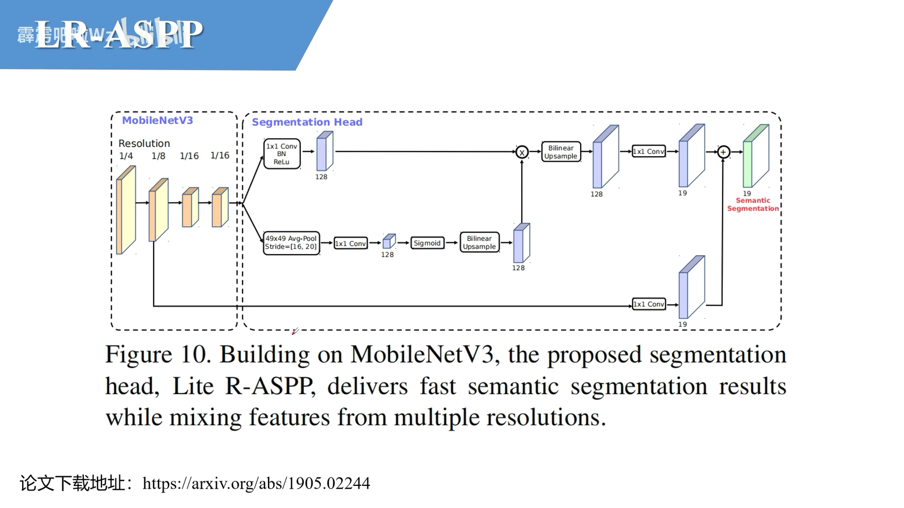
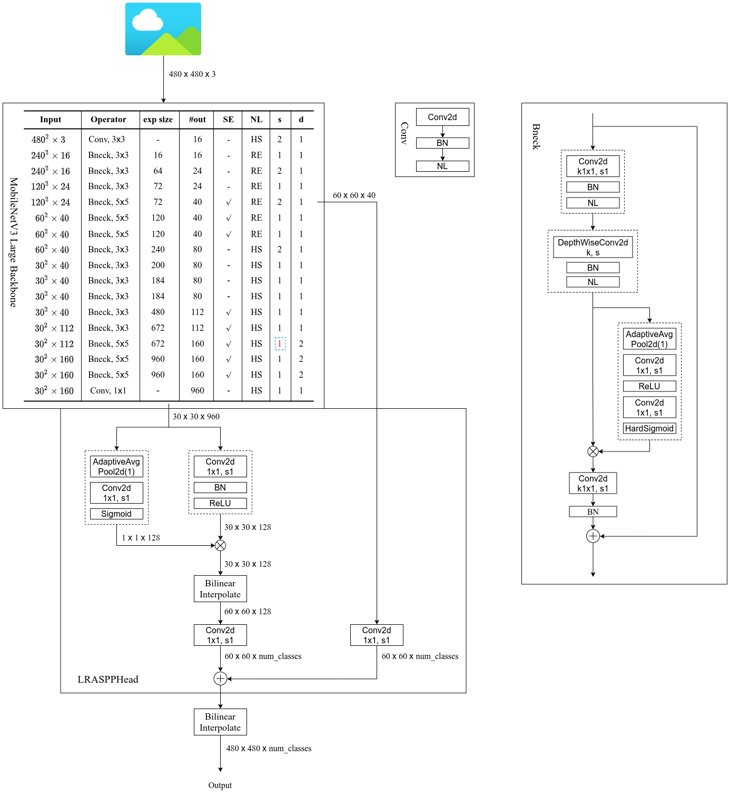
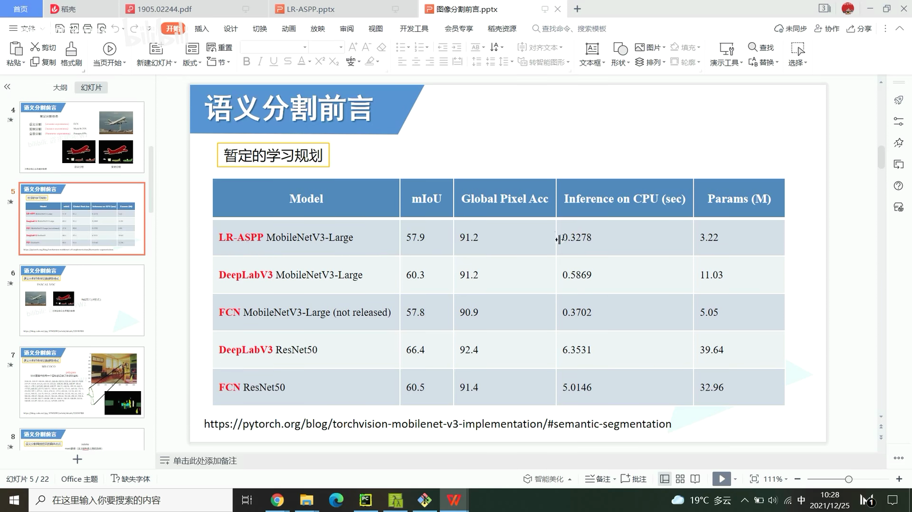

# LR-ASPP

> MobileNetV3下采样16倍,最后没有下采样,并使用了膨胀卷积

> 分割头部分
>
> 分支1:
>
> ​	1x1Conv+BN+ReLU 通道变为128
>
> 分支2(通道注意力):
>
> ​	全局平均池化 -> 1x1Conv 通道变为128 -> sigmoid -> 和上面相乘即可 (上采样部分不需要)
>
> 分支合并 -> 上采样 -> 1x1Conv调整通道数为num_classes
>
> 下采样8倍的数据引过来 -> 1x1Conv调整通道数为num_classes
>
> 分支合并的结果和下采样8倍的结果相加最后上采样8倍得到最后结果

> 下图最右侧的d是扩张卷积倍率
>
> s中红色的是将下采样的2调整为了1,一共下采样4次16倍
>
> 并且从这一层之后的三个卷积换为了膨胀卷积,如右边Bnock所示的DepthWiseConv2d

# 轻量化

