https://blog.csdn.net/qq_37541097/article/details/126255483

论文名称：U2-Net: Goging Deeper with Nested U-Structure for Salient Object Detetion
论文下载地址：https://arxiv.org/abs/2005.09007
官方源码（Pytorch实现）：https://github.com/xuebinqin/U-2-Net
自己实现的仓库（Pytorch实现）：https://github.com/WZMIAOMIAO/deep-learning-for-image-processing/tree/master/pytorch_segmentation/u2net

# 0 前言

U2Net是阿尔伯塔大学（University of Alberta）在2020年发表在CVPR上的一篇文章。该文章中提出的U2Net是针对Salient Object Detetion(SOD)即显著性目标检测任务提出的。而显著性目标检测任务与语义分割任务非常相似，只不过显著性目标检测任务是二分类任务，它的任务是将图片中最吸引人的目标或区域分割出来，故只有前景和背景两类。下图是从DUTS-TR数据集中随便挑的几张图片，第一行是原图，第二行是对应的GT，其中白色区域对应前景（最吸引人的目标或区域）黑色区域对应背景。个人感觉这个任务有点偏主观。

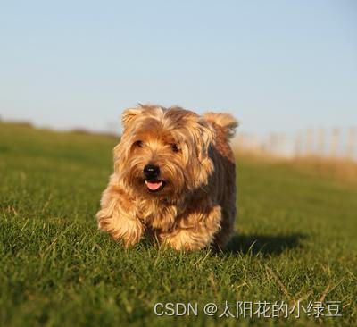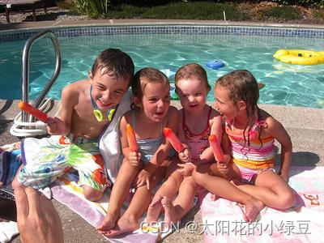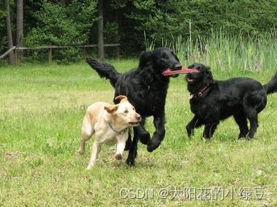

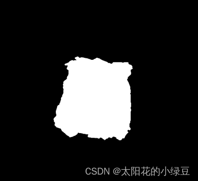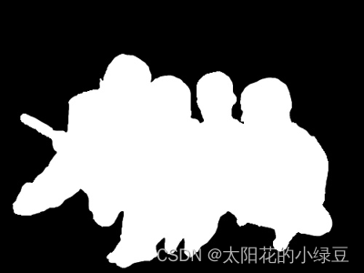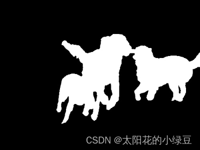

下图展示了当年SOD任务中最先进的一些公开网络在ECSSD数据集上的 m a x F β maxF_{\beta} maxFβ性能指标。通过对比，U2Net无论是在模型size上还是 m a x F β maxF_{\beta} maxFβ指标上都优于其他网络。下图中红色的五角星代表的是标准的U2Net(176.3 MB)，蓝色的五角星代表轻量级的U2Net(4.7 MB)。我自己也有利用U2Net做过些分割实验，感觉效果确实不错。

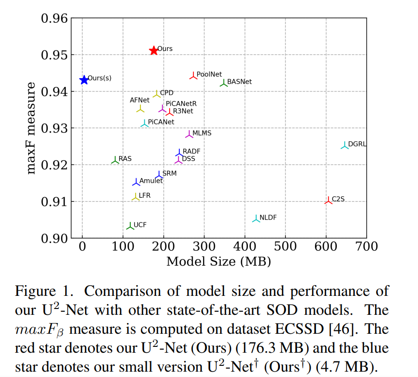

# 1 网络结构解析

下图是原论文中的图5，该图展示了整个U2Net网络的结构。通过下图可以看到网络的主体是一个类似UNet的结构，网络的中的每个Encoder和Decoder模块也是类似UNet的结构，也就是在大的UNet中嵌入了一堆小UNet，所以作者给网络取名为U2Net。其实正确的名称是 ${U^2-Net}$，但是打平方符号太麻烦了，所以直接简写成U2Net。

> 前4层的Encoder和Decoder是相同的
>
> 后面两层的和前面的不同
>
> **下采样部分是max_pool**
>
> **上采样是双线性插值**
>
> 一共下采样5次,32倍

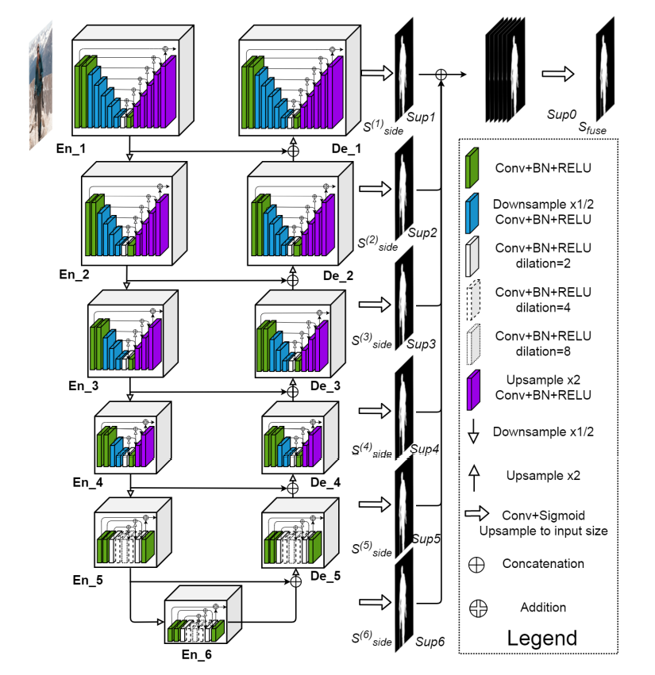

> 通过上图可以看出，`En_1`、`En_2`、`En_3`、`En_4`、`De_1`、`De_2`、`De_3`、`De_4`采用的是同一种`Block`，只不过深度不同。该`Block`就是论文中提出的`ReSidual U-block`简称`RSU`。详情可见下图（论文中的图2）,下图展示的是`RSU-7`结构，其中`7`代表深度(不包括左边第一个,包括最下面中间的)，注意最下面的`3x3`卷积采用的是膨胀卷积，膨胀因子为`2`。

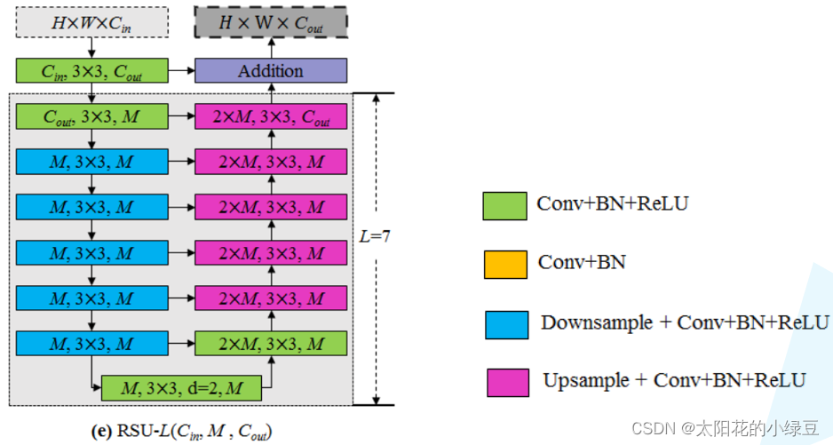

> 下图是我自己重绘的`RSU-7`结构，图中标出了每个输出特征图的shape方便大家进一步理解。
>
> 其中`7`代表深度(不包括左边第一个,包括最下面中间的)，注意最下面的`3x3`卷积采用的是膨胀卷积，膨胀因子为`2`。

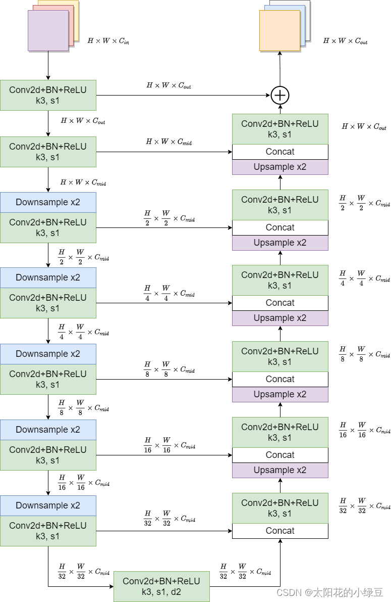

> 弄清楚`RSU`结构后，再回过头看U2Net结构。其中`En_1`和`De_1`采用的是`RSU-7`，`En_2`和`De_2`采用的是`RSU-6`，`En_3`和`De_3`采用的是`RSU-5`，`En_4`和`De_4`采用的是`RSU-4`，最后还剩下`En_5`、`En_6`和`De_5`三个模块。
>
> 这三个模块采用的是`RSU-4F`，注意`RSU-4F`和`RSU-4`两者结构并不相同。在`RSU-4F`中并没有进行下采样或上采样，而是将采样层全部替换成了膨胀卷积。作者在论文`3.2`章节中的解释是到`En_5`时，特征图的分辨率已经很低了，如果接着下采样会丢失很多上下文信息，所以在`RSU-4F`中就不再进行下采样了。下图是我绘制的`RSU-4F`，其中带参数`d`的卷积层全部是膨胀卷积，`d`为膨胀系数。

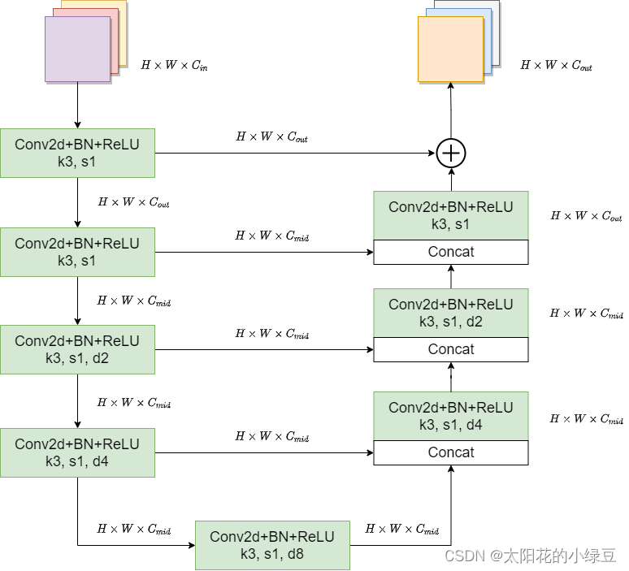

接着再来看下`saliency map fusion module`即显著特征融合模块，通过该模块将不同尺度的`saliency map`进行融合并得到最终预测概率图。如下图所示，首先收集`De_1`、`De_2`、`De_3`、`De_4`、`De_5`以及`En_6`的输出，然后分别通过一个`3x3`的卷积层得到channel为`1`的特征图，接着通过双线性插值缩放到输入图片大小得到`Sup1`、`Sup2`、`Sup3`、`Sup4`、`Sup5`和`Sup6`，然后将这6个特征图进行Concat拼接。最后通过一个`1x1`的卷积层以及`Sigmiod`激活函数得到最终的预测概率图。


到此，U2Net的网络结构就已经讲完了。最后根据论文的表1给出标准U2Net和轻量级U2Net的详细配置信息，其中带 $\dagger$ 符号的是轻量级U2Net。

其中每个模块里的 $I$ 代表 $C_{in}$ 输入通道， $M$ 代表 $C_{mid}$ 隐藏通道， $O$ 代表 $C_{out}$ 输出通道。

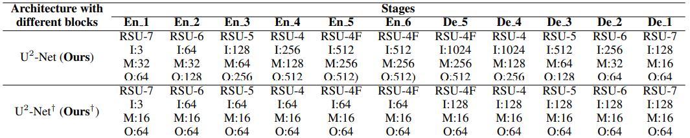

# 2 损失计算

在U2Net中损失计算公式如下所示：
$$
L=\sum_{m=1}^{M} w_{side}^{(m)} l_{side}^{(m)}+w_{fuse} l_{fuse}
$$
> 该损失函数可以看成两部分，一部分是上述提到的`Sup1`、`Sup2`、`Sup3`、`Sup4`、`Sup5`和`Sup6`与GT之间的损失(注意，在计算损失前需要将`Sup1`、`Sup2`、`Sup3`、`Sup4`、`Sup5`和`Sup6`通过`Sigmoid`激活函数得到对应的概率图)，即 $\sum_{m=1}^{M} w_{side}^{(m)}$ 另一部分是最终融合得到的概率图与GT之间的损失，即 $w_{fuse} l_{fuse}$ 。其中 $l$ 是二值交叉熵损失(binary cross-entropy loss)， $w$ 是各损失之间的平衡系数，在源码中 $w$ 全部等于1， $M$ 等于6即`Sup1`至`Sup6`。`Sup1`到`Sup6`因此M=6。

```python
def criterion(inputs, target):
    """计算损失
    Args:
        inputs (List): [x, sub1, sub2, sub3, sub4, sub5, sub6]
        target (Tensor): x

    Returns:
        total_loss
    """
    # 循环遍历所有的input与target求二值交叉熵损失
    losses = [F.binary_cross_entropy_with_logits(inputs[i], target) for i in range(len(inputs))]
    # 求和返回即可(每个损失的权重都相同)
    total_loss = sum(losses)

    return total_loss
```


# 3 评价指标

在论文`4.2`章节中，作者罗列了6种评价指标，有兴趣的小伙伴可以自行查看。这里只简单介绍其中两个常用的指标：`F-measure`和`MAE`。

`F-measure`是结合了Precision和Recall的综合指标，计算公式如下：
$$
F_{\beta}
=
\frac
{\left(1+\beta^{2}\right) \times Precision \times Recall}
{\beta^{2} \times Precision + Recall}
$$
在源码中 $\beta^2$ 设置为0.3，并且最终报告的是 $maxF_{\beta}$ 指标。由于Precision和Recall是多个值，所以 $F_{\beta}$ 也是多个值，而 $maxF_{\beta}$ 取的是其中最大值。

`MAE`是`Mean Absolute Error`的缩写，计算公式如下：
$$
M A E
=
\frac
{1}
{H \times W}
\sum_{r=1}^{H}
\sum_{c=1}^{W}
|P(r, c)-G(r, c)|
$$
其中`P`代表网络预测的概率图，`G`代表真实的GT，H和W分别代表图片的高和宽。

# 4 DUTS数据集简介

针对SOD任务，公开的数据集也很多，这里只简单介绍DUTS数据集。

- DUTS数据集官方下载地址：http://saliencydetection.net/duts/
- 如果下载不了，可以通过我提供的百度云下载，链接: https://pan.baidu.com/s/1nBI6GTN0ZilqH4Tvu18dow 密码: r7k6
- 其中DUTS-TR为训练集，DUTS-TE是测试（验证）集，数据集解压后目录结构如下：

```
├── DUTS-TR
│      ├── DUTS-TR-Image: 该文件夹存放所有训练集的图片
│      └── DUTS-TR-Mask: 该文件夹存放对应训练图片的GT标签（Mask蒙板形式）
│
└── DUTS-TE
       ├── DUTS-TE-Image: 该文件夹存放所有测试（验证）集的图片
       └── DUTS-TE-Mask: 该文件夹存放对应测试（验证）图片的GT标签（Mask蒙板形式）
```

根据官方的介绍，DUTS数据集包含了10553张训练图片，5019张测试图片。其中所有的训练图片采集自ImageNet DET训练/验证集，而所有的测试图片采集自ImageNet DET测试集以及SUN数据集。所有的ground truths(GT)由50个人手动标注。在前言中，我们已经简单展示了DUTS-TR中的部分训练图片以及GT，如下图所示。


下面给出了通过自定义数据集读取方式读取DUTS数据集的简单案例，其中`root`是指向DUTS-TR以及DUTS-TE所在的根目录，`train`为`True`表示读取训练集DUTS-TR，`False`表示读取测试集DUTS-TE：

```python
import os

import cv2
import torch.utils.data as data


class DUTSDataset(data.Dataset):
    def __init__(self, root: str, train: bool = True, transforms=None):
        assert os.path.exists(root), f"path '{root}' does not exist."
        if train:
            self.image_root = os.path.join(root, "DUTS-TR", "DUTS-TR-Image")
            self.mask_root = os.path.join(root, "DUTS-TR", "DUTS-TR-Mask")
        else:
            self.image_root = os.path.join(root, "DUTS-TE", "DUTS-TE-Image")
            self.mask_root = os.path.join(root, "DUTS-TE", "DUTS-TE-Mask")
        assert os.path.exists(self.image_root), f"path '{self.image_root}' does not exist."
        assert os.path.exists(self.mask_root), f"path '{self.mask_root}' does not exist."

        image_names = [p for p in os.listdir(self.image_root) if p.endswith(".jpg")]
        mask_names = [p for p in os.listdir(self.mask_root) if p.endswith(".png")]
        assert len(image_names) > 0, f"not find any images in {self.image_root}."

        # check images and mask
        re_mask_names = []
        for p in image_names:
            mask_name = p.replace(".jpg", ".png")
            assert mask_name in mask_names, f"{p} has no corresponding mask."
            re_mask_names.append(mask_name)
        mask_names = re_mask_names

        self.images_path = [os.path.join(self.image_root, n) for n in image_names]
        self.masks_path = [os.path.join(self.mask_root, n) for n in mask_names]

        self.transforms = transforms

    def __getitem__(self, idx):
        image_path = self.images_path[idx]
        mask_path = self.masks_path[idx]
        image = cv2.imread(image_path, flags=cv2.IMREAD_COLOR)
        assert image is not None, f"failed to read image: {image_path}"
        image = cv2.cvtColor(image, cv2.COLOR_BGR2RGB)  # BGR -> RGB
        h, w, _ = image.shape

        target = cv2.imread(mask_path, flags=cv2.IMREAD_GRAYSCALE)
        assert target is not None, f"failed to read mask: {mask_path}"

        if self.transforms is not None:
            image, target = self.transforms(image, target)

        return image, target

    def __len__(self):
        return len(self.images_path)


if __name__ == '__main__':
    train_dataset = DUTSDataset("/data/DUTS", train=True)
    print(len(train_dataset))

    val_dataset = DUTSDataset("/data/DUTS", train=False)
    print(len(val_dataset))

    i, t = train_dataset[0]
```

终端输出：

```
10553
5019
```

