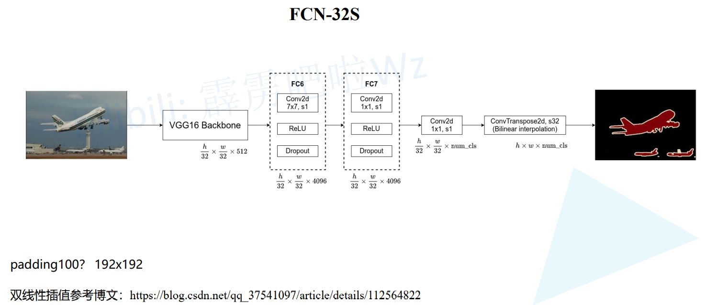

# FCN

收个段对端的针对像素级预测的全卷积网格


> 将最后的全连接层换为卷积
>
> 宽高不再变为1了


# 卷积代替全连接层

> 全连接层的参数量为 $7 \times 7 \times 512 \times 4096$
>
> 卷积层的参数量为 $7 \times 7 \times 512 \times 4096$
>
> 可以发现参数量相同,所以只要将原来的全连接层reshape赋值即可
>
> 可以添加padding,如果添加3x3padding,那么卷积后宽高不变


# 3个FCN

> 上采样32倍就是 -32s,其他同理


## FCN-32S

> padding100,防止通过VGG backbone后的宽高小于7,100主要是为了防止图片大小小于32
>
> FC6 FC7 有padding=3,所以宽高不变
>
> 后面接一个1x1Conv,卷积核个数调整为num_classes+1
>
> 最后转置卷积.步距32,就是上采样32倍,使用了双线性插值初始化了转置卷积参数,训练时冻结训练参数,所以就是双线性插值,直接使用双线性插值即可



## FCN-16S

> 转置卷积的kernel_size=4x4 上采样2倍
>
> 短接分支使用max_pooling4的输出,max_pooling的下采样是16倍,然后通过1x1Conv将通道数调整为num_classes+1
>
> 两个分支相加之后再通过转置卷积上采样16倍


## FCN-8S

> 相比16S又增加了来自max_pooling3的信息
>
> 下采样32倍和16倍的输出经过一个转置卷积上采样2倍,然后和max_pooling3的输出相加后通过转置卷积上采样8倍


# 损失计算

> 每个像素点的多个通过针对真实label进行交叉熵损失计算,最后求平均值


# 源代码使用ResNet50

> Layer3和Layer4不下采样,s=1,3x3Conv使用了膨胀卷积(右侧的两幅图的s都为1)
>
> Layer3 dilation=2; Layer4 dilation=4
>
> Layer3是辅助分支,Layer4是主分支
>
> FCNHead调整通道为1/4
>
> FCNHead最后的1x1Conv会调整分类个数
>
> 最后通过双线性插值还原到原图大小


## 混淆矩阵计算

> 1

```python
            #---------------------------------------------#
            #   结果和target展平放入混淆矩阵
            #   结果放入每个的最大类别 argmax(1) 找channel最大值
            #---------------------------------------------#
            confmat.update(target.flatten(), output.argmax(1).flatten())
```


> 1

```python
        with torch.inference_mode():
            #---------------------------------------------#
            #   寻找GT中为目标的像素索引
            #---------------------------------------------#
            k = (a >= 0) & (a < n)
            #---------------------------------------------#
            #   统计像素真实类别a[k]被预测成类别b[k]的个数(这里的做法很巧妙)
            #---------------------------------------------#
            inds = n * a[k].to(torch.int64) + b[k]  #  n *  可以理解为在混淆矩阵中展平后的位置
```


> 1

```python
```

