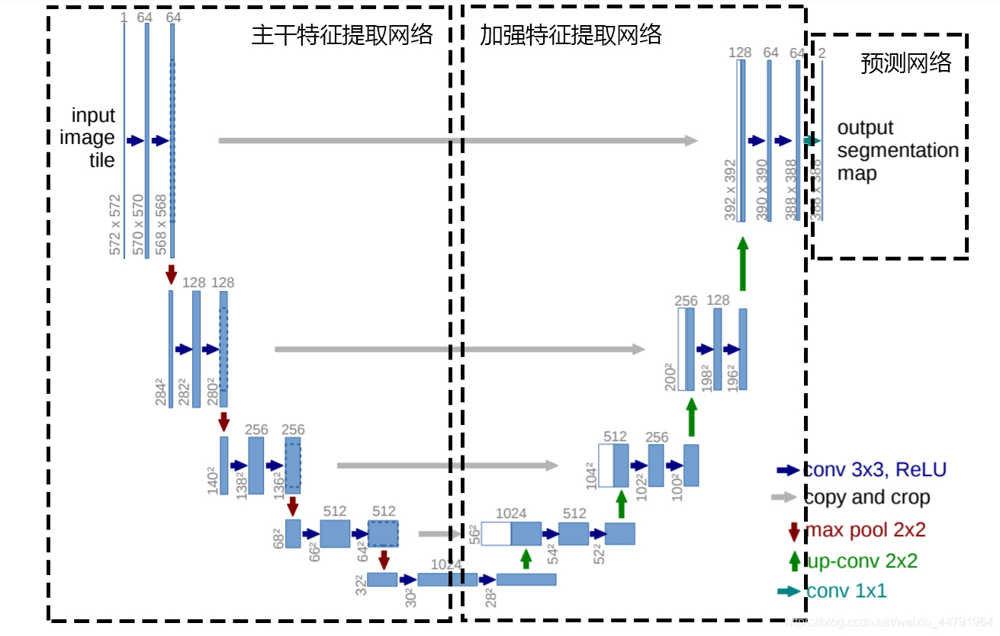
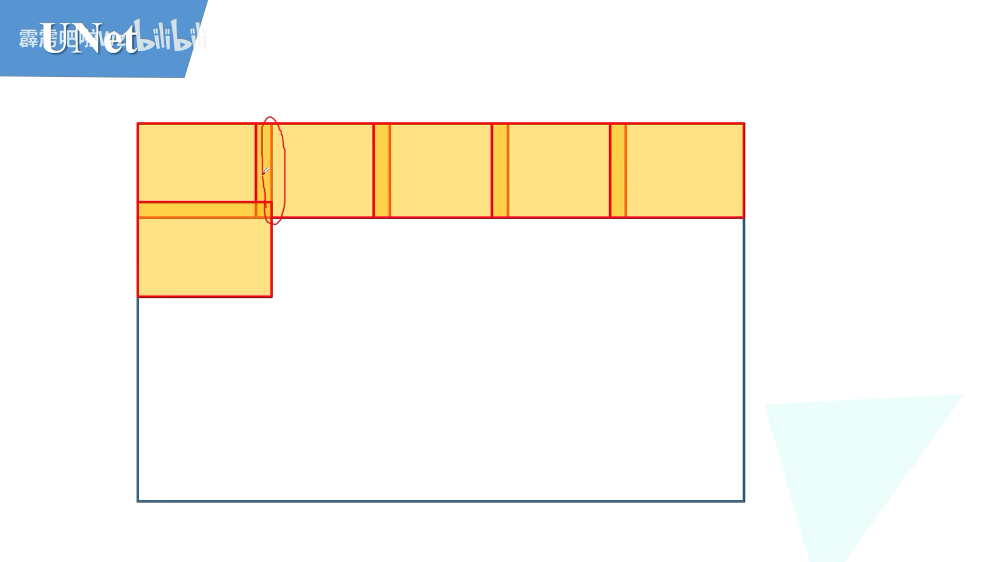
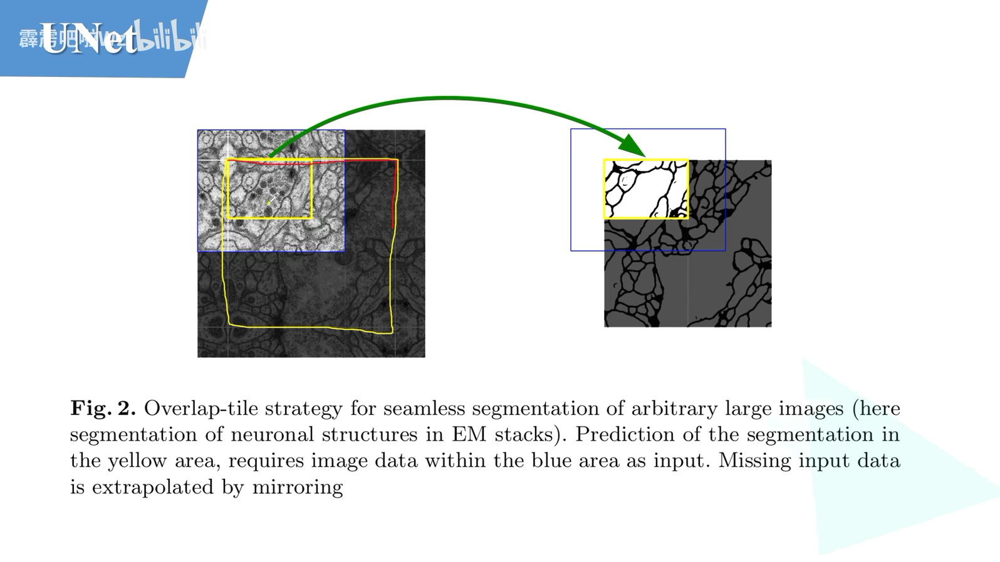
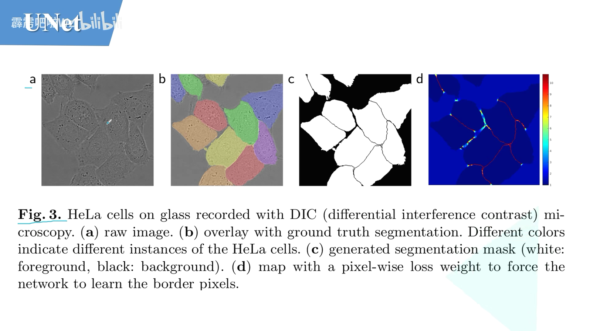
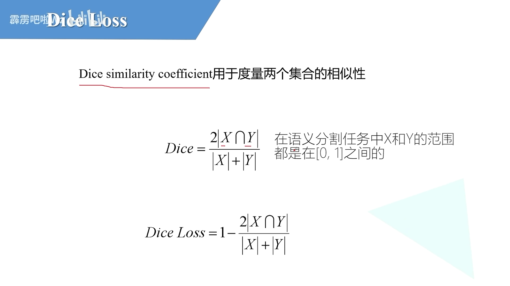
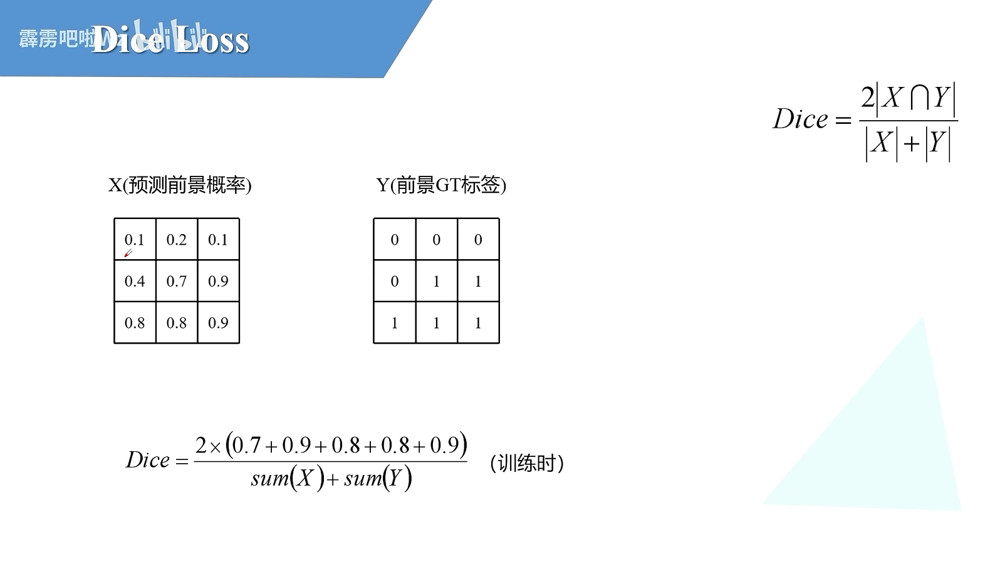
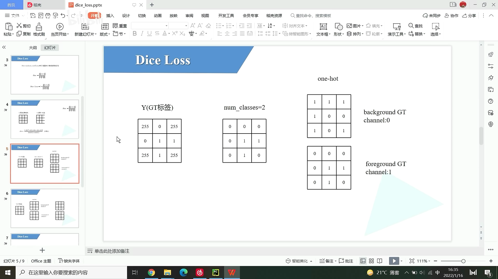
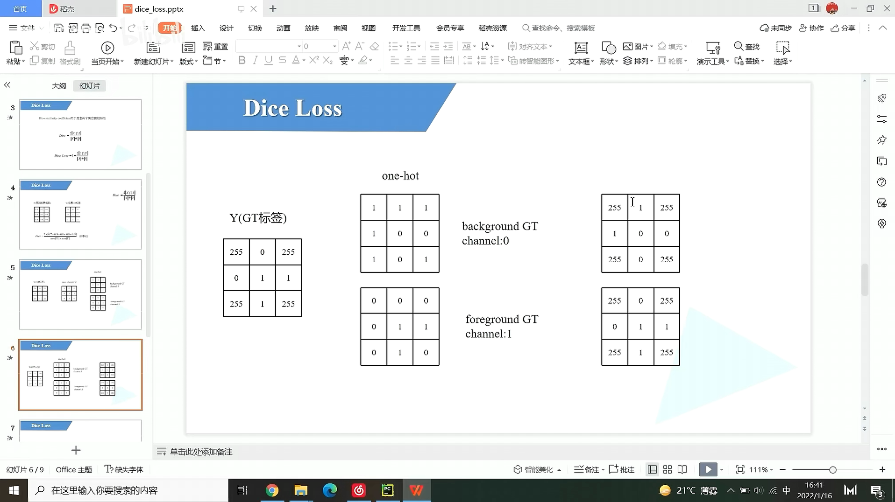

# UNet结构




# 针对大图片

> 将大图片分割为一个个patch,且边缘有重叠,为了更好地分割



> 1



# 数据集

> 


> a: 原图
>
> b: 实例分割数据集
>
> c: 语义分割数据集
>
> d: pixel-wise 细胞背景之间权重更大,大块背景面积权重更小
>
> d: 显示的是pixel-wise热力图,可以看到大块背景颜色最浅,细胞间隙的颜色是红色,权重很高



# Dice损失

> Dice在 0~1 之间
>
> Dice Loss = 1 - Dice 也在 0~1 之间



> 计算方式
>
> 分子是两个矩阵的点乘再相加 * 2
>
> 分母是两个矩阵的和
>
> 数字预测越大,分子每个值相乘后就越大,总的DIce就越小
>
> 
>
> 计算是在训练时使用,验证时取最大值下标为0或1即可



## 数据预处理

> 将255忽略,值变为0 								 左边两幅图
>
> 转换成one-hot编码 背景: 10 前景: 01  	右边两幅图
>
> 255区域再变为255,计算损失忽略掉       下面第二幅图

```python
#---------------------------------------------#
#   每个类别都要有GT,对于背景,指定类别都要求
#---------------------------------------------#
def build_target(target: torch.Tensor, num_classes: int = 2, ignore_index: int = -100):
    """
    build target for dice coefficient

    ignore_index: 忽略的颜色, 默认 -100 不使用, 这里忽略了255
    """
    dice_target = target.clone()
    if ignore_index >= 0:
        #---------------------------------------------#
        #   找255的位置
        #---------------------------------------------#
        ignore_mask = torch.eq(target, ignore_index)
        #---------------------------------------------#
        #   255区域变为0
        #---------------------------------------------#
        dice_target[ignore_mask] = 0
        #---------------------------------------------#
        #   转换成one-hot编码 背景: 10 前景: 01
        #   [N, H, W] -> [N, H, W, C]
        #---------------------------------------------#
        dice_target = nn.functional.one_hot(dice_target, num_classes).float()
        #---------------------------------------------#
        #   255区域再变为255,计算损失忽略掉
        #---------------------------------------------#
        dice_target[ignore_mask] = ignore_index
    else:
        dice_target = nn.functional.one_hot(dice_target, num_classes).float()
	
    # [N, H, W, C] -> [N, C, H, W]
    return dice_target.permute(0, 3, 1, 2)
```




