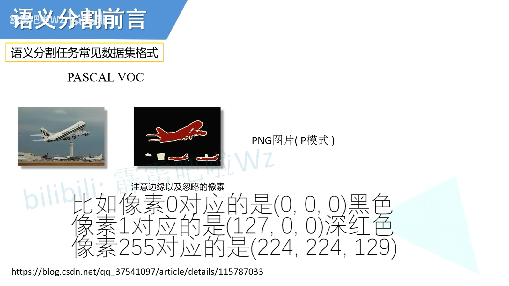
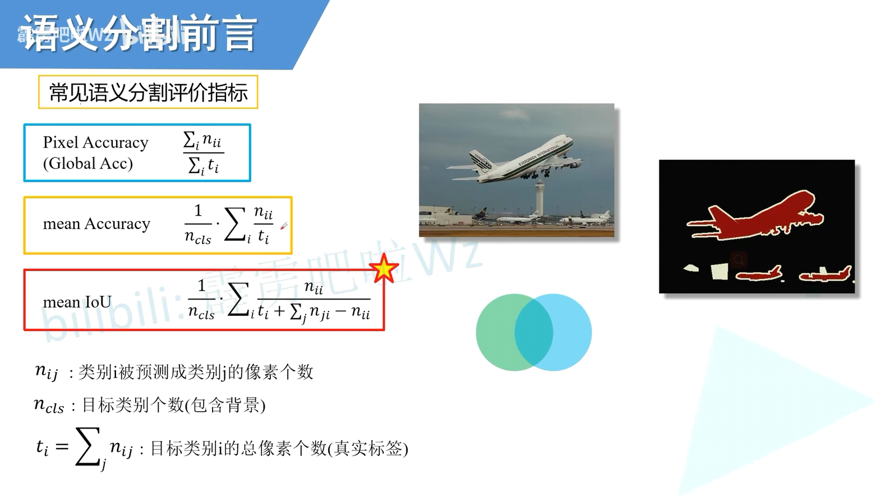
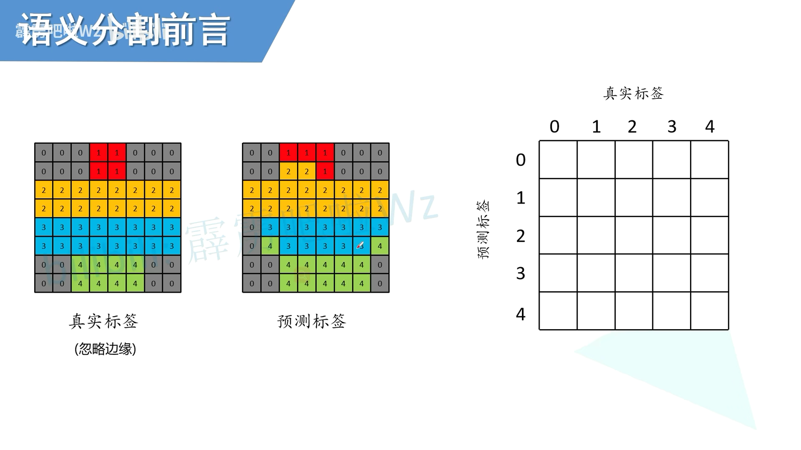
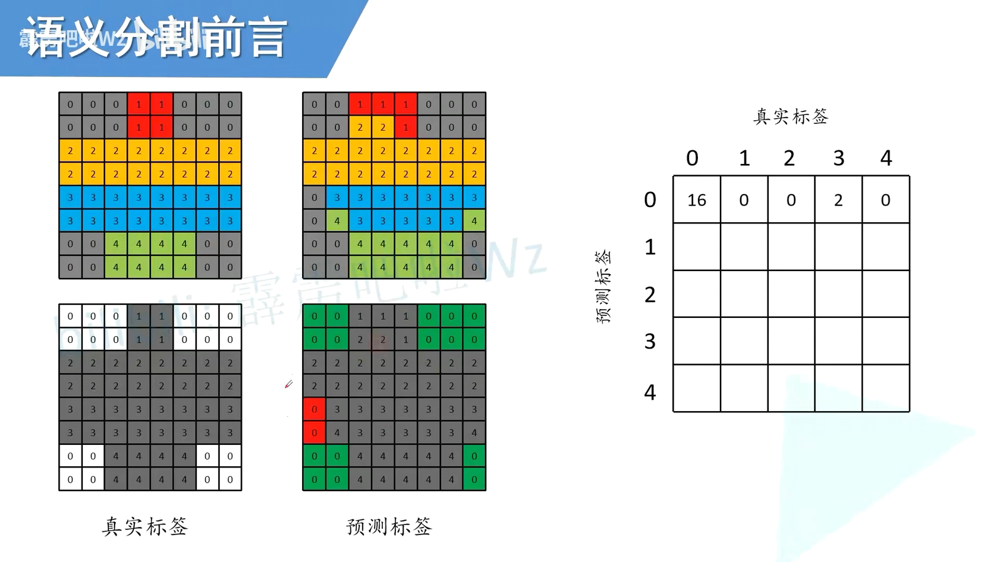
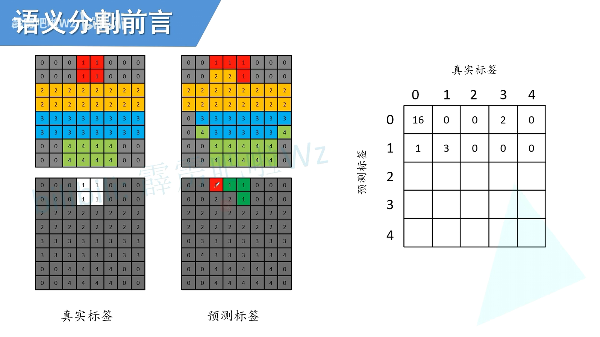
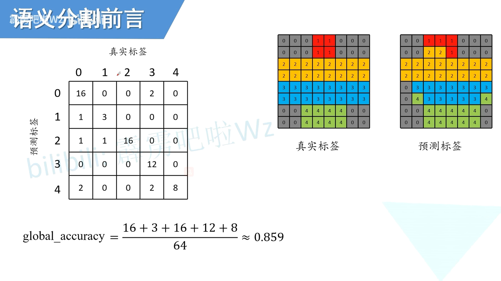
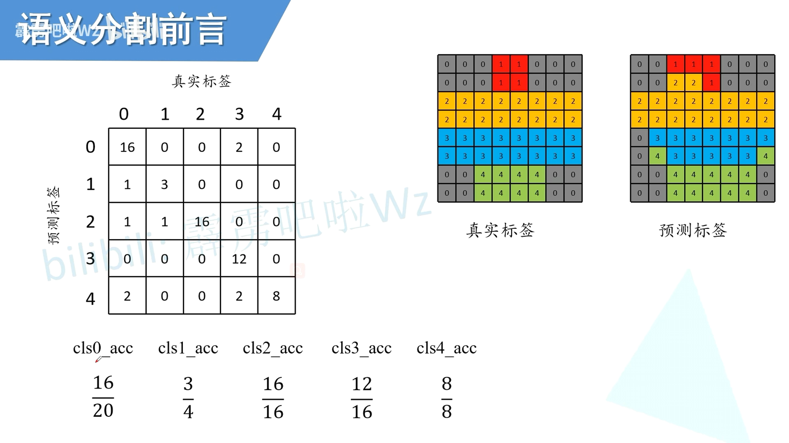
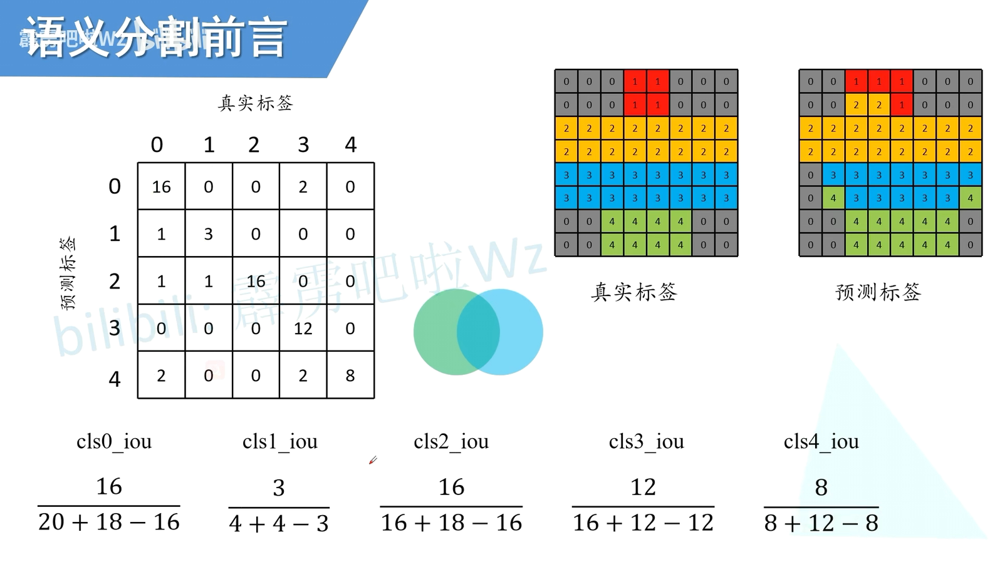

# 图片标注

> 数据是调色板模式,单通道会显示颜色

> 边缘是白色,计算时会忽略它

# 常见评价指标

- Pixel Accuracy:  所有预测正确的像素个数 / 总像素个数
- mean Accuracy: 每个类别的Accuracy总和除以类别个数
- mean IoU:         每各类别的IoU总和除以类别个数

> 计算详解
>
> 通过混淆矩阵运算

> 检测0
>
> 真实 对于0设置为白色,非0设置为灰色
>
> 预测 预测为0的全部标出,正确的标位绿色,错误的标位红色

> 检测1
>
> 真实 对于1设置为白色,非1设置为灰色
>
> 预测 预测为1的全部标出,正确的标位绿色,错误的标位红色

> ...
>
> 最终结果

> Global Accuracy = 对角线总和 / 总和

> 针对每个类别的mean Accuracy
>
> 对角线(预测正确的总数) / 每一列的总和(真实像素数量)

> mean IoU
>
> $对角线(预测正确的总数) / (相对的列+行-对角线)$
>
> 对角线 = 交
>
> 相对的列+行-对角线 = 并

